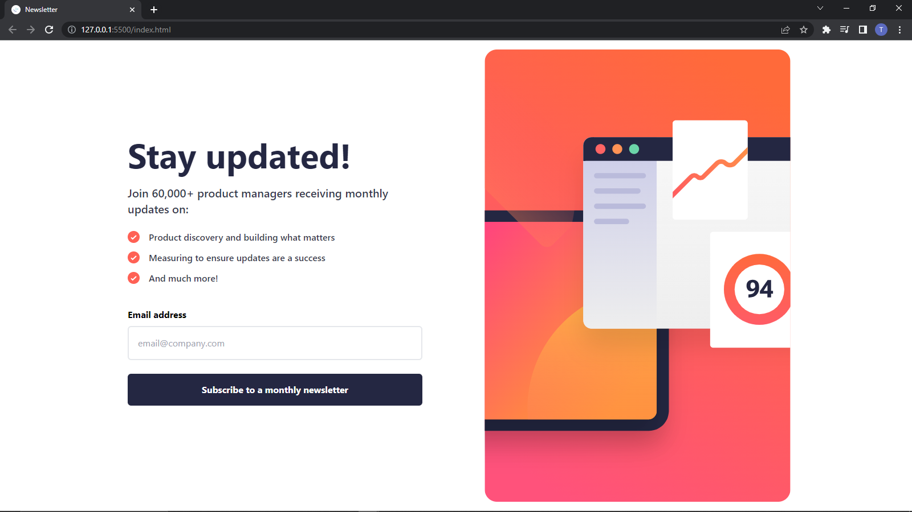
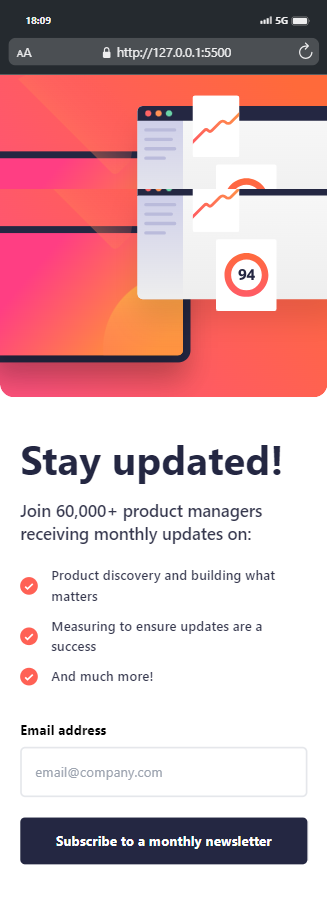

# Frontend Mentor - Newsletter sign-up form with success message solution

This is a solution to the [Newsletter sign-up form with success message challenge on Frontend Mentor](https://www.frontendmentor.io/challenges/newsletter-signup-form-with-success-message-3FC1AZbNrv). Frontend Mentor challenges help you improve your coding skills by building realistic projects. 

## Table of contents

- [Overview](#overview)
  - [The challenge](#the-challenge)
  - [Screenshot](#screenshot)
  - [Links](#links)
- [My process](#my-process)
  - [Built with](#built-with)
  - [What I learned](#what-i-learned)
- [Author](#author)
- [Acknowledgments](#acknowledgments)

## Overview

### The challenge

Users should be able to:

- Add their email and submit the form
- See a success message with their email after successfully submitting the form
- See form validation messages if:
  - The field is left empty
  - The email address is not formatted correctly
- View the optimal layout for the interface depending on their device's screen size
- See hover and focus states for all interactive elements on the page

### Screenshot

### Links

- Solution URL: [Solution source code](https://github.com/TeeHigh/Newsletter)
- Live Site URL: [Live hosting of website](https://teehigh.github.io/Newsletter/)

## My process

Started off with html and installed tailwind library
Included javascript and creating website UI

### Built with

- Semantic HTML5 markup
- CSS custom properties
- Flexbox
- CSS Grid
- Mobile-first workflow
- [Tailwind](https://tailwindcss.com/) - CSS library

### What I learned

I learnt the mobile first workflow with tailwind and javascript regular expression which was used in the email validation and can be used to test input for validation.

I also learnt how to break functions into different components.

## Author

- Website - [Ifeoluwase Taiwo](https://github.com/TeeHigh)
- Frontend Mentor - [@TeeHigh](https://www.frontendmentor.io/profile/TeeHigh)
- Twitter - [@Tee__High](https://www.twitter.com/Tee__High)

## Acknowledgments

Help with regex and validation (https://www.youtube.com/@edsHTML)